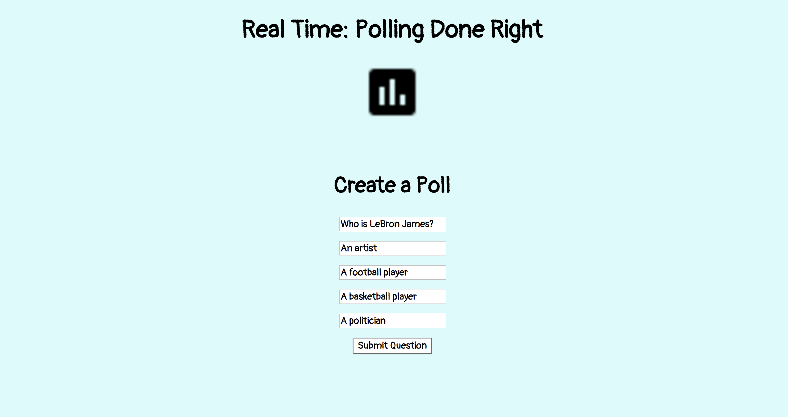
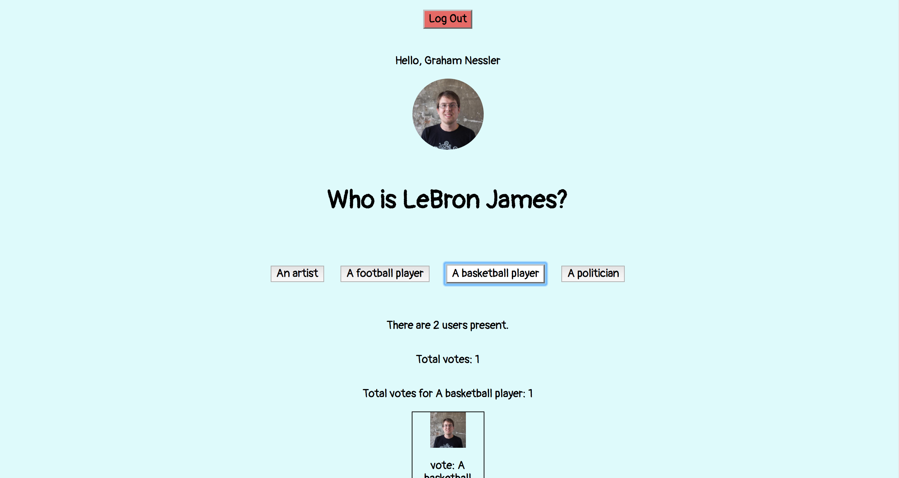

##Real Time: A Polling App

[Check it out!](https://real-time-gness.herokuapp.com/)

[When a question exists...](https://real-time-gness.herokuapp.com/question)

This is an application that allows a user to create a question (after authenticating with a password) and then post the question to a live channel, where users (who must authenticate with Github) can post answers. The users all see the tally of answer choices chosen, who chose which answer (with Github profile pics next to each choice), the total number of votes, and the number of users in the room. The question choice keys can be any value; they are not restricted to a strict format such as A, B, C, D.

Main tools used: Websockets, ExpressJS, Auth0, Node.js, jQuery, Mocha and Chai.

* [Project specs](http://frontend.turing.io/projects/real-time.html)
